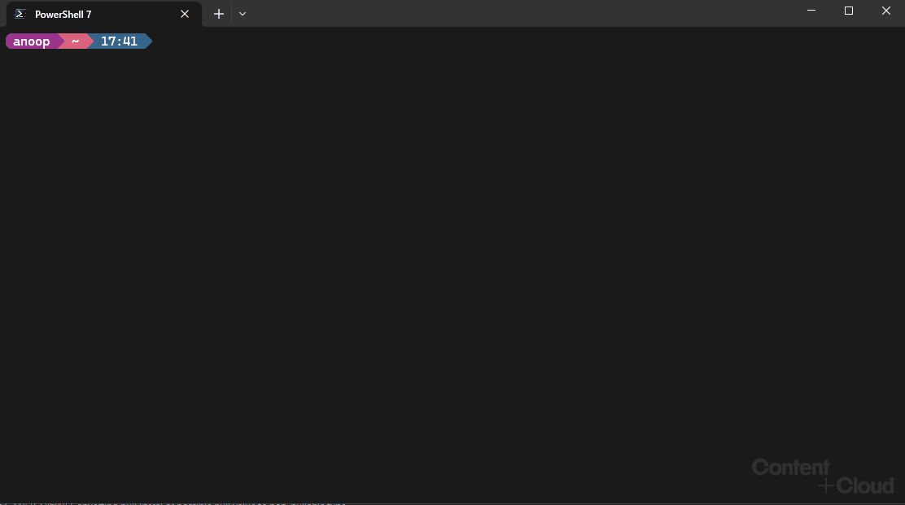

# CLI for Microsoft 365 PowerShell Predictor module

## Overview

[CLI for Microsoft 365 PowerShell Predictor](https://www.powershellgallery.com/packages/CLI.Microsoft365.PowerShell.Predictor) is a PowerShell
module that helps you navigate the cmdlets and parameters of
[CLI for Microsoft 365](https://pnp.github.io/cli-microsoft365/) in PowerShell. It provides suggestions for command completion when using CLI for Microsoft 365 in PowerShell.

CLI for Microsoft 365 PowerShell Predictor uses the
[subsystem plugin model](/powershell/scripting/learn/experimental-features#pssubsystempluginmodel)
available in PowerShell 7.2. This updated version requires
[PSReadLine 2.2.2](https://www.powershellgallery.com/packages/PSReadLine/2.2.2) or higher to display
suggestions.



## Requirements

Required configuration for CLI for Microsoft 365 PowerShell Predictor:

- [PowerShell 7.2](https://github.com/PowerShell/PowerShell/) or higher
- [PSReadline 2.2.2](https://github.com/PowerShell/PSReadLine/) or higher

Install the latest version of PSReadLine:

```powershell
Install-Module -Name PSReadline
```

#### Set preferred source and view for suggestions

Enable predictions from history and plugins

```powershell
Set-PSReadLineOption -PredictionSource HistoryAndPlugin
```

Enable list view:

```powershell
Set-PSReadLineOption -PredictionViewStyle ListView
```

## Getting started

### Install CLI for Microsoft 365 PowerShell Predictor

To install the CLI.Microsoft365.PowerShell.Predictor PowerShell module run the following

```powershell
Install-Module -Name CLI.Microsoft365.PowerShell.Predictor
```

### Import CLI for Microsoft 365 PowerShell Predictor

### Option 1

To import the CLI.Microsoft365.PowerShell.Predictor PowerShell module for all sessions, 

1. Open the PowerShell profile file in a text editor

```powershell
notepad $PROFILE
```

2. Add the following in the end

```powershell
Import-Module -Name CLI.Microsoft365.PowerShell.Predictor
```
### Option 2

To import the CLI for Microsoft 365 PowerShell Predictor module in the current session run the following

```powershell
Import-Module -Name CLI.Microsoft365.PowerShell.Predictor
```

### Use M365 CLI PowerShell Predictor

Once imported, start typing M365 CLI cmdlet (e.g. `m365 spo app`) and see the predictions loading.

## Changing predictions search method

By default the module uses `StartsWith` search i.e. it shows predictions that starts with the input entered. This can be changed to `Contains` by using the following cmdlet

```powershell
Set-PnPPredictorSearch -Method Contains
```
The module then needs to re-imported.

`Contains` - as per the name shows predictions that contain the entered input.

## Updating predictions

The predictions are based on the CLI for Microsoft 365 version installed on the machine. When a new version of CLI for Microsoft 365 is installed then the predictions are automatically updated when the module is imported or can be updated by running the following function

```powershell
Update-M365CLIPredictions $(m365 version).replace('v', '').replace('"', '')
```
## Uninstallation

Once installed and enabled, CLI for Microsoft 365 PowerShell Predictor is loaded in the PowerShell profile.
To uninstall the CLI.Microsoft365.PowerShell.Predictor module:

1. Close **all** PowerShell sessions including VS Code.

1. Launch a PowerShell session with no profile.

   ```powershell
   pwsh -noprofile
   ```

1. Uninstall CLI for Microsoft 365 PowerShell Predictor

   ```powershell
   Uninstall-Module -Name CLI.Microsoft365.PowerShell.Predictor -Force
   ```

1. Close PowerShell